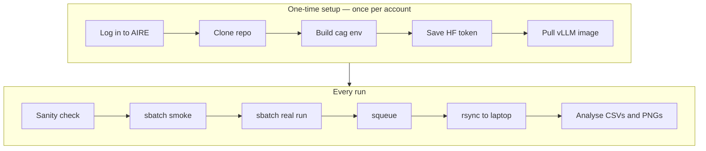

# AIRE Quickstart — run Climate-Action-GABM on Leeds's HPC

A repo-specific, copy-pasteable recipe for running Climate-Action-GABM on Leeds's [AIRE](https://arc.leeds.ac.uk/aire/) HPC: from a fresh account to a completed **smoke** job and a canonical **split50 Run-14**, then results back on your laptop.

For generic AIRE / Slurm fundamentals (account setup, storage rules, `#SBATCH` reference, partitions), see the companion primer: [AIRE_HPC_repo_primer.md](AIRE_HPC_repo_primer.md). This quickstart is the recipe; the primer is the reference.

---

## Golden path

If you've set up before, this is all you need. **🔧 = do once per AIRE account · 🔁 = every run.** Section numbers point to the detail below.

```bash
# 🔧 ONE-TIME per AIRE account (details in §§2–3)
ssh <you>@<aire-login-host>                                          # §2 (first-time login help linked there)
cd ~ && git clone git@github.com:compolis/Climate-Action-GABM.git && cd Climate-Action-GABM   # §3.3
module load miniforge && conda env create -f environment.yaml         # §3.4 — builds the `cag` env
mkdir -p ~/.cache/huggingface && read -rsp 'HF token: ' T && \
    printf '%s' "$T" > ~/.cache/huggingface/token && \
    chmod 600 ~/.cache/huggingface/token && unset T                   # §3.5
cd ~ && module add apptainer && apptainer pull docker://vllm/vllm-openai:v0.8.5   # §3.6 — vLLM image
```

```bash
# 🔁 EVERY run
cd ~/Climate-Action-GABM
sbatch scripts/aire/run.sh --preset smoke                                      # §5 — cheap canary
sbatch scripts/aire/run.sh --preset r14_canonical --exposure-targets split50   # §6 — real run
squeue --me                                                                    # §9 — watch it
# then, on your LAPTOP:
rsync -avP aire:/mnt/scratch/<user>/cag/runs/ ~/src/aire-runs/                  # §8 — pull results
```



<details>
<summary><strong>Jargon in 60 seconds</strong></summary>

- **`sbatch`** — submit a job to the Slurm queue; it returns a job id and runs when a GPU is free.
- **`squeue` / `scancel`** — list / cancel your queued jobs.
- **Slurm** — the scheduler that hands your job a GPU node.
- **`$SCRATCH`** — fast scratch storage on AIRE (`/mnt/scratch/<user>`); runs are written here, not in your home dir.
- **SIF / apptainer** — a Singularity/Apptainer container image (`.sif`); we run vLLM inside one for reproducibility.
- **vLLM** — the server that hosts the LLM on the GPU node and answers the simulation's prompts.
- **`rash` bastion / Duo** — Leeds routes off-campus SSH through the `rash` gateway and prompts for Duo two-factor.
- **preset** — a named bundle of run settings (`smoke`, `r14_canonical`); `--preset NAME` applies it.
- **`cag`** — both the conda environment name and the Python package (`python -m cag`).
</details>

<details>
<summary><strong>Mac local-dev sidebar</strong> — most steps work locally too</summary>

On a Mac, start `mlx_lm.server --port 8080` with `mlx-community/Qwen3-8B-4bit`, then run `PYTHONPATH=src python -m cag --preset smoke --outdir data/output/smoke`. `SIM_CONFIG` defaults already point at `http://localhost:8080/v1`, so nothing else is needed. The rest of this guide assumes AIRE.
</details>

---

## Table of contents

1. [Prerequisites](#1-prerequisites)
2. [SSH into AIRE](#2-ssh-into-aire)
3. [One-time prep on AIRE](#3-one-time-prep-on-aire)
4. [Free sanity checks (no GPU)](#4-free-sanity-checks-no-gpu)
5. [First sbatch — the smoke job](#5-first-sbatch--the-smoke-job)
6. [First real experiment — split50 Run-14](#6-first-real-experiment--split50-run-14)
7. [Reading the output](#7-reading-the-output)
8. [Pull results back to your laptop](#8-pull-results-back-to-your-laptop)
9. [Monitoring and cancelling jobs](#9-monitoring-and-cancelling-jobs)
10. [Resume a killed job](#10-resume-a-killed-job)
11. [Multi-job sweep](#11-multi-job-sweep)
12. [Common errors and fixes](#12-common-errors-and-fixes)
13. [Updating the repo on AIRE later](#13-updating-the-repo-on-aire-later)
14. [Re-clone the repo from scratch](#14-re-clone-the-repo-from-scratch)
- [Appendix A. Flag reference — every SIM_CONFIG knob](#appendix-a-flag-reference--every-sim_config-knob)
- [Cheat sheet](#cheat-sheet)

---

## 1. Prerequisites

| You need | Why | How |
| --- | --- | --- |
| An AIRE account | To `ssh` and run jobs | Request via the Leeds RSE / ARC team (see [primer §1](AIRE_HPC_repo_primer.md)) |
| GitHub access to the repo | To `git clone` | Account with read access to `compolis/Climate-Action-GABM` |
| A Hugging Face account | To download the model weights | Free at <https://huggingface.co>; create a **read** token at *Settings → Access Tokens* |
| An SSH client locally | To reach AIRE | macOS/Linux: built-in `ssh`. Windows: WSL or PuTTY. First-time login help in §2 |

If anything is missing, fix it before continuing. The rest of this guide assumes you can `ssh` into AIRE.

---

## 2. SSH into AIRE

From your laptop:

```bash
ssh <your-username>@<aire-login-host>
```

You should land in your `$HOME` on a login node. Everything below runs on AIRE unless marked **(on your laptop)**.

> **First time connecting?** Leeds IT's step-by-step login guide covers the exact SSH command for macOS / Windows / Linux and the on- vs off-campus (VPN / `rash` bastion) differences: <https://it.leeds.ac.uk/it?id=kb_article_view&sysparm_article=KB0018284>. **It requires a University login**, so external collaborators can't open it — ask your Leeds contact for the login host and VPN details instead.

> **Tip.** Set up the SSH-config alias in §8 so you can just type `ssh aire` and skip the Duo prompt on repeat connections within a short window.

**Next:** verify your shell is on AIRE (`hostname` reports a login node), then continue to §3.

---

## 3. One-time prep on AIRE

Do these once per AIRE account. If you later re-clone the repo, you only repeat §3.3 (clone) and possibly §3.4 (env) — see §14.

> **⚠ Every new login shell needs `module load miniforge`.** AIRE does **not** auto-load conda — in a fresh shell `conda activate cag` gives `conda: command not found` until you load the module. Same for `module add apptainer` before re-pulling the SIF. To make it automatic, append `module load miniforge` to `~/.bashrc`.

### 3.1 Move to your home directory

```bash
cd ~
```

### 3.2 Generate an SSH key and add it to GitHub

The repo is private, so AIRE needs an SSH key registered with GitHub. Generate one on the login node, register the **public** half with GitHub, then verify:

```bash
ssh-keygen -t ed25519 -C "you@example.com"     # press Enter at every prompt
cat ~/.ssh/id_ed25519.pub                       # copy this whole line into GitHub
ssh -T git@github.com                           # expect: "Hi <user>! You've successfully authenticated"
```

Register the printed public key at GitHub → *Settings → SSH and GPG keys* (account-wide) **or** the repo's *Settings → Deploy keys* (repo-only; leave write access off). If `ssh -T` says `Permission denied (publickey)`, the key wasn't registered correctly.

<details>
<summary>Details — step-by-step, expected output, and the HTTPS-token alternative</summary>

**Step 1 — generate the key pair on AIRE.** Press Enter at every prompt to accept defaults (no passphrase is fine on a personal AIRE account; add one if you prefer).

```bash
ssh-keygen -t ed25519 -C "you@example.com"
```

You'll get:

```text
Your identification has been saved in /home/<user>/.ssh/id_ed25519
Your public key has been saved in /home/<user>/.ssh/id_ed25519.pub
```

**Step 2 — print the public key so you can copy it.**

```bash
cat ~/.ssh/id_ed25519.pub
```

Copy the **entire line** (starts with `ssh-ed25519`, ends with your email comment).

**Step 3 — register it with GitHub.** On your laptop browser:

- For account-wide access: <https://github.com/settings/keys> → *New SSH key* → paste → save.
- For repo-only access (deploy key): the repo's *Settings → Deploy keys → Add deploy key* → paste → save (leave write access off).

**Step 4 — verify from AIRE.**

```bash
ssh -T git@github.com
```

Expected:

```text
Hi <your-github-username>! You've successfully authenticated, but GitHub does not provide shell access.
```

If you see "Permission denied (publickey).", the key wasn't registered correctly — go back to step 3.

**Alternative — HTTPS + PAT.** If you can't use SSH, clone over HTTPS with a [GitHub Personal Access Token](https://github.com/settings/tokens) (fine-grained, "Contents: Read" on the repo): `git clone https://<token>@github.com/compolis/Climate-Action-GABM.git`. We recommend SSH because the token doesn't end up baked into your remote URL.
</details>

### 3.3 Clone the repo

```bash
git clone git@github.com:compolis/Climate-Action-GABM.git
cd Climate-Action-GABM
```

<details>
<summary>Details — org repo vs. your fork, and using a non-default SSH key</summary>

**Org repo vs. your fork.** This clones the canonical **org** repo `compolis/Climate-Action-GABM` — the right choice for *running* canonical experiments on AIRE, since you want the merged source of truth. If instead you are *developing code* and following the fork-based contributor flow ([DEV_QUICKSTART](../DEV_QUICKSTART.md)), clone your own fork — `git@github.com:<your-github-username>/Climate-Action-GABM.git` — and add the org repo as `upstream` (`git remote add upstream git@github.com:compolis/Climate-Action-GABM.git`). Either way the SSH-key setup is identical, and `scripts/aire/run.sh` doesn't care which remote you cloned from.

**If your AIRE key isn't the default `~/.ssh/id_ed25519`** (e.g. you keep a dedicated `~/.ssh/aire_repo`), the bare `git clone git@...` form won't pick it up. Use:

```bash
git clone -c core.sshCommand="ssh -i ~/.ssh/aire_repo -o IdentitiesOnly=yes" \
    git@github.com:compolis/Climate-Action-GABM.git
cd Climate-Action-GABM
git config core.sshCommand "ssh -i ~/.ssh/aire_repo -o IdentitiesOnly=yes"
```

The first command clones with the right key; the second persists it in `.git/config` so future `git pull`/`fetch` use the same key without flag soup. `IdentitiesOnly=yes` stops ssh from trying every other key in your agent first (which can trigger `Permission denied` on accounts with multiple GitHub identities).
</details>

### 3.4 Build the conda environment

```bash
module load miniforge
conda env create -f environment.yaml
```

This creates a conda env named `cag` with every Python dependency. First-time build takes ~5–10 minutes. If it ever drifts (someone added a dependency), update with `conda env update -f environment.yaml --prune` from inside the repo.

### 3.5 Hugging Face token

`scripts/aire/run.sh` reads the token from the file `~/.cache/huggingface/token` (preferred — it survives logins and never lands in shell history) or the `HF_TOKEN` env var. Grab a **read** token at <https://huggingface.co/settings/tokens>, and while signed in accept the model licence at <https://huggingface.co/Qwen/Qwen3-14B> (otherwise the first job 401s on download even with a valid token).

Write it (silent paste, no history leak), then verify:

```bash
mkdir -p ~/.cache/huggingface && \
    read -rsp 'Paste HF token: ' HF_TOKEN_VAL && \
    printf '%s' "$HF_TOKEN_VAL" > ~/.cache/huggingface/token && \
    chmod 600 ~/.cache/huggingface/token && unset HF_TOKEN_VAL && echo

wc -c ~/.cache/huggingface/token   # ~37 bytes = fresh token; ~74 = double-pasted, rerun the write
```

<details>
<summary>Details — why each flag, and the env-var / huggingface-cli alternatives</summary>

`read -rsp` reads silently (your token is not echoed and not stored in `~/.bash_history`); `printf '%s'` writes the token with no trailing newline; `chmod 600` locks it to your user only; `unset` clears it from the shell. To also inspect the contents: `cat ~/.cache/huggingface/token; echo` (the file is `chmod 600`, so only you can read it). If the byte count or contents look wrong, just rerun the write command — it overwrites cleanly.

**Alternative — environment variable.** `echo 'export HF_TOKEN=hf_...' >> ~/.bashrc && source ~/.bashrc`. Works, but the token now sits plaintext in your dotfile and any subprocess can see it via `env`. Prefer the file form above.

**Alternative — `huggingface-cli login`.** Writes the same file. Requires installing `huggingface_hub` (`pip install huggingface_hub` inside the `cag` env). Skip it unless you want the CLI for other reasons — the sim itself doesn't need it.
</details>

### 3.6 Pull the vLLM container

`scripts/aire/run.sh` defaults to `$HOME/vllm-openai-v0.8.5.sif` — pulled once, reused forever. Pinned at `v0.8.5` for reproducibility.

```bash
cd ~
module add apptainer
apptainer pull docker://vllm/vllm-openai:v0.8.5
```

You'll get `vllm-openai-v0.8.5.sif` (~6 GB) in `$HOME`. The script finds it there by default; override with `SIF_IMAGE=/path/to/other.sif sbatch ...` if you put it elsewhere.

**Next:** all one-time prep is done. Return to the repo (`cd ~/Climate-Action-GABM`) and continue to §4.

---

## 4. Free sanity checks (no GPU)

Confirm the env is healthy before spending GPU time. These run on the login node in milliseconds and burn zero compute budget:

```bash
cd ~/Climate-Action-GABM
module load miniforge && conda activate cag
PYTHONPATH=src python -m cag --list-presets            # lists smoke, r14_canonical, ...
PYTHONPATH=src python -m cag --preset smoke --dry-run  # resolves the final config as JSON, no LLM call
```

If both print sensible output, your env imports cleanly and the CLI is wired up.

> **Fresh login?** Run `module load miniforge` first, or `conda activate` reports `conda: command not found` (see the box in §3).

<details>
<summary>Example <code>--list-presets</code> output</summary>

```text
smoke
  Fast smoke-test run shape: 10 agents, 2 days, no peer messaging. ...
  config:
    n_citizens = 10
    days = 2
    k_peers_per_day = 0
    thinking = False

r14_canonical
  Run-14 baseline run shape: 50 agents, 5 days, ...
  config:
    n_citizens = 50
    days = 5
    ...
```
</details>

**Next:** submit the smoke sbatch (§5).

---

## 5. First sbatch — the smoke job

A 10-agent, 2-day run that exercises every code path (server bring-up, prompt chain, surveys, CSV write, plot render). Use it as a cheap canary before a real run.

```bash
cd ~/Climate-Action-GABM
sbatch scripts/aire/run.sh --preset smoke
# -> Submitted batch job 12345
```

Wall-clock: **~5–15 min**. The very first sbatch also downloads the model weights (a few GB), adding 10–20 min.

<details>
<summary>Which model it uses, and what <code>run.sh</code> actually does</summary>

**Which model does the smoke run use?** The `smoke` preset does **not** pin a model — it's a pure run-shape bundle. On AIRE, `scripts/aire/run.sh` hardcodes `--model "$HF_MODEL"`, and `HF_MODEL` defaults to `Qwen/Qwen3-14B` (served by vLLM inside the SIF). To test a different model, prefix the sbatch line: `HF_MODEL=other/model sbatch scripts/aire/run.sh --preset smoke`.

**What the command does:**

- `scripts/aire/run.sh` is a thin Slurm script. It boots a vLLM server on this node, waits until `http://localhost:8000/v1/models` answers, then runs `python -m cag --provider local --base-url ... --outdir $SCRATCH/cag/runs/run_<jobid> <your flags>`. The trailing `--preset smoke` is forwarded verbatim.
- Output goes to `$SCRATCH/cag/runs/run_<jobid>/`.
- The Slurm stdout/stderr files (`LLM-cag-run_<jobid>.out`/`.err`) land in the directory you submitted from (the repo root).
</details>

**Next:** monitor it (§9); once it finishes cleanly, go to §6.

---

## 6. First real experiment — split50 Run-14

Once the smoke succeeds, submit the canonical research run. Same `run.sh`, different flags.

```bash
sbatch scripts/aire/run.sh --preset r14_canonical --exposure-targets split50
```

| Token | What it does |
| --- | --- |
| `sbatch scripts/aire/run.sh` | Queue the AIRE launcher script (vLLM bring-up + `python -m cag` + cleanup) |
| `--preset r14_canonical` | Apply the Run-14 baseline bundle (50 agents, 5 days, `k_peers_per_day=0`, `day0_anchor=ground_truth_with_rationale`, `thinking=False`, default `memory` preset; the Condition-B two-step survey is always on) |
| `--exposure-targets split50` | Pin the political-exposure mix to a `{A-only: 0.5, B-only: 0.5}` split (everyone gets exactly one side's broadcasts). The canonical persuasion test condition |

Wall-clock: **~40–90 min** depending on prompt yield with Qwen3-14B.

> **Important — first-time model download.** The first time you submit with a model that isn't already in the Hugging Face cache, the download can exceed the **1500 s** vLLM-readiness wait baked into `run.sh`, and the job fails before any LLM call. Use **`--time=06:00:00`** on that first submission. Once cached, subsequent runs warm up in < 2 min and the standard wall-clock is fine.

```bash
sbatch --time=06:00:00 scripts/aire/run.sh --preset r14_canonical --exposure-targets split50
```

Per-day checkpointing is **on by default**, so a wall-clock kill always leaves the last completed day on disk to `--resume` (§10).

**The three flags you'll change most** (full list in [Appendix A](#appendix-a-flag-reference--every-sim_config-knob)):

| Flag | Sets |
| --- | --- |
| `--preset` | a whole run-shape bundle (`smoke`, `r14_canonical`) |
| `--exposure-targets` | who hears which side (`split50`, `neither`, or a JSON mix) |
| `--reach-a` / `--reach-b` | each side's audience fraction (reach-asymmetry experiments) |

<details>
<summary>Details — <code>--time</code> and other Slurm overrides, opting out of checkpoints</summary>

`--time` is an `sbatch` flag — it overrides the `#SBATCH --time` header inside the script. Any Slurm directive is overridable this way (`--mem=120G`, `--cpus-per-task=16`, ...). Pass `--no-checkpoint-every-day` to the Python CLI if you want to skip per-day checkpoints for a throwaway smoke test.
</details>

**Next:** while it runs, read §7.

---

## 7. Reading the output

Each run lands in `$SCRATCH/cag/runs/run_<jobid>/`. When a run finishes, check these four first:

1. **`run.log` final TIMING block** — simulation time, per-agent-day cost, no late crashes.
2. **`config.json`** — the exact resolved configuration (the run's fingerprint). If two runs disagree, diff their `config.json`s — that's the ground truth, not your sbatch line.
3. **`vllm_server.log` first ~50 lines** — confirms `Loading model 'Qwen/Qwen3-14B'` (or whatever you intended); catches the "asked for X, got Y" class of bugs.
4. **`opinion_trajectories.csv`** — non-empty, `days × agents × 6 policies` rows (1500 for a default r14 run). Sanity: `agents.unique()` = 50, `days.max()` = 4 (zero-indexed).

<details>
<summary>Full run-directory layout (every CSV / JSON / PNG)</summary>

```text
run_<jobid>/
├── run.log                          # full sim log; final TIMING block is the summary
├── vllm_server.log                  # server bring-up; first lines confirm which model loaded
├── config.json                      # exact resolved SIM_CONFIG (the run's fingerprint)
├── opinion_trajectories.csv         # per-(agent, day, policy) numeric opinion
├── package_index_trajectories.csv   # per-(agent, day) pro-climate index (package mode only)
├── opinion_shares.csv               # derived: % support over time, per policy
├── package_index_shares.csv         # derived: % support over time, package level
├── reflections.csv                  # internal monologue after each exposure event
├── messages.csv                     # every broadcast and peer message, sender→recipient
├── survey_reasoning.csv             # end-of-day survey rationale
├── survey_raw_response.csv          # raw LLM survey text (pre-parse)
├── daily_summaries.csv              # per-day per-agent compressed memory
├── ground_truth.csv                 # YouGov anchor values per (agent, policy)
├── package_ground_truth.csv         # YouGov anchor index (package mode only)
├── opinion_trajectory.png           # plot
├── package_index_trajectories.png   # plot
├── opinion_shares.png               # plot
├── package_index_shares.png         # plot
└── checkpoints/                     # always (default-on); use --no-checkpoint-every-day to suppress
    └── checkpoint_meta.json + per-day CSV dumps
```
</details>

**Next:** pull results to your laptop (§8), or compose your next experiment from [Appendix A](#appendix-a-flag-reference--every-sim_config-knob).

---

## 8. Pull results back to your laptop

> **⚠ Run this on your LAPTOP, not inside the AIRE ssh session.** The destination path lives on your laptop; if you run `rsync` while still ssh'd into AIRE you'll get `mkdir failed: No such file or directory`. Either `exit` the AIRE shell first, or open a fresh terminal on your laptop.

**Mirror every run in one go** — the command to reuse day to day. `-avP` archives, prints a progress bar, and resumes partial transfers:

```bash
rsync -avP aire:/mnt/scratch/<user>/cag/runs/ ~/src/aire-runs/
```

- Replace `<user>` with your Leeds AIRE username (run `whoami` on AIRE if unsure — e.g. `vbwt265`).
- Replace `~/src/aire-runs/` with wherever you keep runs on your laptop; `rsync` creates it if the parent exists.
- The `aire:` shorthand relies on the SSH-config alias below. Without it, use the full form `<user>@<aire-login-host>:/mnt/scratch/<user>/cag/runs/`.
- The trailing slash on `runs/` copies its *contents*, so each run lands as `~/src/aire-runs/run_<jobid>/`. Re-running is cheap — `rsync` only transfers what changed.

<details>
<summary>SSH-config alias — type <code>ssh aire</code> and skip repeat Duo prompts</summary>

Leeds AIRE goes through the `rash` bastion. Put this once in `~/.ssh/config` on your laptop:

```sshconfig
Host rash
    HostName rash.leeds.ac.uk
    User <your-leeds-username>
    ControlMaster auto
    ControlPath ~/.ssh/cm-%r@%h:%p
    ControlPersist 10m

Host aire
    HostName aire.leeds.ac.uk
    User <your-leeds-username>
    ProxyJump rash
    ControlMaster auto
    ControlPath ~/.ssh/cm-%r@%h:%p
    ControlPersist 10m
```

- `ProxyJump rash` — AIRE login nodes aren't directly reachable from outside Leeds; ssh hops through `rash.leeds.ac.uk` automatically. No more manual bastion shell.
- `ControlMaster auto` + `ControlPath` + `ControlPersist 10m` — reuses one TCP connection (and one Duo authentication) for 10 min. The first `ssh aire` triggers Duo; the next `rsync aire:...` or `ssh aire` inside that window is instant.

After saving the config, every command shortens to `aire:/mnt/scratch/<user>/cag/runs/...`.
</details>

<details>
<summary>Filtered / single-run transfer (CSV / PNG / JSON / logs only), plus caveats</summary>

For a single run, append its folder: `.../cag/runs/run_<jobid>/ ~/src/aire-runs/run_<jobid>/`. To pull only CSVs / PNGs / JSON / logs:

```bash
LOCAL_DIR=~/cag_results/run_12345                          # on your laptop
REMOTE_DIR=<user>@<aire-login-host>:/mnt/scratch/<user>/cag/runs/run_12345

mkdir -p "$LOCAL_DIR"
rsync -avh \
    --include='*/' \
    --include='*.csv' --include='*.png' --include='*.json' --include='*.log' \
    --exclude='*' \
    "$REMOTE_DIR"/ "$LOCAL_DIR"/
```

- **Use the literal `/mnt/scratch/<user>/...` path, not `$SCRATCH`.** `$SCRATCH` only expands on AIRE; from your laptop it's an empty string and rsync silently picks the wrong source.
- **`mkdir -p` first.** rsync creates the leaf directory but not its parents, so `~/cag_results/` must exist first or you'll get `mkdir failed`.
- **Trailing slash on `$REMOTE_DIR/`** copies the *contents* of the run dir into `$LOCAL_DIR`; drop it to nest the run dir inside instead.
- **Want the vLLM server log too?** It's already covered by `*.log`. To skip it explicitly, add `--exclude='vllm_server.log'`.
- **Off-campus / Duo MFA:** rsync over SSH triggers the same Duo two-factor prompt your interactive `ssh` does. Respond once and rsync proceeds. The SSH-config alias above skips it on repeat connections.
</details>

**Next:** open the CSVs in your notebook of choice (`notebooks/19_full_simulation.ipynb` is the canonical analysis pattern).

---

## 9. Monitoring and cancelling jobs

```bash
squeue --me                                  # all your queued/running jobs
squeue -j <jobid>                            # one job
tail -f LLM-cag-run_<jobid>.out              # live stdout (the .out file is in your submit dir)
sacct -j <jobid> --format=JobID,State,Elapsed,MaxRSS,ExitCode   # post-mortem accounting
scancel <jobid>                              # cancel a job
```

<details>
<summary>More — cancel all cag jobs, tail the latest, watch GPU</summary>

```bash
# Cancel every running cag job you submitted:
scancel --user="$USER" --name=LLM-cag-run

# Tail the most recently submitted job:
tail -f $(ls -t LLM-cag-run_*.out | head -1)

# Track GPU utilisation on a running job (jump onto the node):
srun --jobid=<jobid> --pty nvidia-smi
```
</details>

See the [primer §4](AIRE_HPC_repo_primer.md) for the full Slurm reference.

---

## 10. Resume a killed job

If a job hits the wall-clock limit (or is cancelled, or the node dies), resume from the last completed day — checkpoints are on by default, so this works for every run unless you passed `--no-checkpoint-every-day`:

```bash
RESUME_FROM=$SCRATCH/cag/runs/run_<old_jobid> sbatch scripts/aire/run.sh \
    --preset r14_canonical \
    --exposure-targets split50
```

The new job writes back into the **same** `OUTDIR` (`$RESUME_FROM` — don't pass `--outdir`), forwards `--resume` automatically, and replays from `<outdir>/checkpoints/`.

<details>
<summary>Resume contract — which config keys must match (hard) vs. may change (soft)</summary>

Checked at startup, fails loudly on mismatch:

- **Hard keys (must match exactly):** `n_citizens`, `random_seed`, `network_type`, `communication_mode`, `package_policies`, `day0_anchor`, `reach_a`, `reach_b`, `audience_cap`, `political_exposure_mode`, `political_exposure_targets`, `affinity_weights`, `political_message_source`, `political_message_set`, `memory`. Structural — changing these would invalidate prior agent state. (`memory` is hard because the verbatim window drives which days get compressed into `daily_summaries`, so a mid-run change would make the stored summaries inconsistent.)
- **Soft keys (changeable; warning emitted):** `llm_model`, `llm_provider`, `survey_model`, `survey_provider`, `thinking`, `llm_temperature`, `local_base_url`, `local_extra_body`, `local_timeout_s`.

If you need to change a hard key, start a fresh run instead of resuming.
</details>

**Next:** for a planned multi-condition study, prefer §11.

---

## 11. Multi-job sweep

For ≥3 related jobs (different exposure targets, different reach values, etc.), use the sweep wrapper: one text file lists the per-job flag suffix on each line, the wrapper submits one `sbatch` per line.

The shipped example, [scripts/aire/sweeps/r14_v2.txt](../scripts/aire/sweeps/r14_v2.txt):

```text
--preset r14_canonical --exposure-targets split50
--preset r14_canonical --exposure-targets neither
--preset r14_canonical --exposure-targets neither --day0-anchor llm_survey
```

Submit all three:

```bash
bash scripts/aire/sweep.sh scripts/aire/sweeps/r14_v2.txt
```

Each line becomes one `sbatch scripts/aire/run.sh <that line>`. The wrapper prints every submitted job ID and appends them to `<sweep_file>.log` for later cross-reference. Pass extra `sbatch` flags applied to **every** job after the file name:

```bash
bash scripts/aire/sweep.sh scripts/aire/sweeps/r14_v2.txt --time=06:00:00 --mem=120G
```

<details>
<summary>When to use sweep vs. plain <code>sbatch</code>, and authoring a new sweep</summary>

- **Sweep is better:** ≥3 related jobs; you want a single artefact (the `.log`) recording the whole experiment grid; you want identical Slurm settings.
- **Plain sbatch is better:** one-off, or each job needs different Slurm settings.

To author a new sweep, drop a new `.txt` file under [scripts/aire/sweeps/](../scripts/aire/sweeps/) — one line per job, `#` for comments. No code change.
</details>

**Next:** errors? §12.

---

## 12. Common errors and fixes

| Symptom (in `LLM-cag-run_<jobid>.err` or `.out`) | Cause | Fix |
| --- | --- | --- |
| `ERROR: HF_TOKEN is not set` | Token missing on this account | Write `~/.cache/huggingface/token` (§3.5), OR `export HF_TOKEN=hf_...` in `~/.bashrc` |
| `ERROR: vLLM container not found at: $HOME/vllm-openai-v0.8.5.sif` | Image not pulled, or in wrong place | Re-do §3.6, or `SIF_IMAGE=/your/path.sif sbatch ...` |
| `[wait] ERROR: server not ready after 1500s` | First run downloading multi-GB weights | Re-submit with `--time=06:00:00` (or `MAX_WAIT_SECONDS=3000 sbatch ...`). Subsequent runs reuse the cache |
| `ERROR: src/cag not found under REPO_DIR=...` | You submitted `sbatch` from outside the repo | `cd ~/Climate-Action-GABM && sbatch ...` |
| `Cannot resume: config key 'X' changed` | You changed a hard key while passing `--resume` | Either revert the key, or start a fresh run (drop `--resume` and `RESUME_FROM`) |
| `ModuleNotFoundError: No module named 'cag'` | Conda env not activated, or `PYTHONPATH` not set | `conda activate cag`; for local invocations include `PYTHONPATH=src` |
| `error: missing required config key(s): ['n_citizens', 'days']` | You forgot both, and didn't pass a preset that supplies them | Add `--n-citizens N --days D` or `--preset smoke` |
| `Job exited 1 immediately, no run.log written` | Crash before logging started — check `LLM-cag-run_<jobid>.err` | Most often bad JSON in `--exposure-targets`, or a typo in a preset name (argparse rejects with exit 2) |

Anything else: open `LLM-cag-run_<jobid>.out` and search for `ERROR` from the bottom up.

---

## 13. Updating the repo on AIRE later

The repo will change. To pull updates into your AIRE clone:

```bash
cd ~/Climate-Action-GABM
git pull
```

If `environment.yaml` changed:

```bash
conda env update -f environment.yaml --prune
```

If `scripts/aire/run.sh` mentions a newer vLLM image version, repeat §3.6 with that version. The previous SIF can be deleted (or kept side-by-side and selected with `SIF_IMAGE=...`). The conda env, the model weights cache (`$SCRATCH/HF_cache`), and the SIF live outside the repo tree — none of those need touching on a `git pull`.

---

## 14. Re-clone the repo from scratch

Sometimes a `git pull` (§13) isn't enough — a rebased or force-pushed history, a wedged working tree, or you just want a clean slate. This **backs up** the old clone rather than deleting it (in case you left uncommitted run configs or notes in there), clones fresh, then re-points at the conda env and Hugging Face token — both of which live **outside** the repo tree and survive untouched.

> **What survives a reclone (all outside `~/Climate-Action-GABM`):** the `cag` conda env, the model weights cache (`$SCRATCH/HF_cache`), the vLLM `.sif` container, and the HF token file (`~/.cache/huggingface/token`). You normally only re-verify these, not rebuild them.

> **SSH key note.** The commands below use a dedicated deploy key `~/.ssh/aire_repo` (see [§3.2](#32-generate-an-ssh-key-and-add-it-to-github)). That key must be registered on **`compolis/Climate-Action-GABM`** — as a repo *deploy key* or an SSH key on your GitHub account. If it was only ever added to a personal fork, add it to the org repo (or your account) first, otherwise the clone fails with `Permission denied (publickey)`. If you instead rely on the default `~/.ssh/id_ed25519`, drop the `-c core.sshCommand=...` prefix from Step 2.

**Step 1 — back up the old clone (don't delete it outright).**

```bash
cd ~ && mv Climate-Action-GABM Climate-Action-GABM.bak.$(date +%Y%m%d_%H%M%S) 2>/dev/null; ls -d Climate-Action-GABM* 2>/dev/null
```

Renames the checkout to a timestamped `Climate-Action-GABM.bak.YYYYMMDD_HHMMSS` folder and lists `$HOME` matches so you can confirm. `2>/dev/null` hushes the error if there was nothing to move. Once the fresh clone works, **delete the backup** to reclaim home quota: `rm -rf ~/Climate-Action-GABM.bak.*`.

**Step 2 — fresh clone (with the AIRE deploy key).**

```bash
cd ~ && git clone -c core.sshCommand="ssh -i ~/.ssh/aire_repo -o IdentitiesOnly=yes" git@github.com:compolis/Climate-Action-GABM.git && cd Climate-Action-GABM && git log --oneline -3
```

`git log --oneline -3` prints the three most recent commits so you can eyeball the history. **Persist the key** so future `git pull`/`fetch` don't need the flag:

```bash
git config core.sshCommand "ssh -i ~/.ssh/aire_repo -o IdentitiesOnly=yes"
```

**Step 3 — load conda, confirm the env exists, then activate.**

```bash
module load miniforge && conda env list | grep -E '^cag\s' && conda activate cag && which python
```

`which python` should point inside `.../envs/cag/bin/python`. If the env is **missing** (e.g. a brand-new account), build it once with [§3.4](#34-build-the-conda-environment): `conda env create -f environment.yaml`.

**Step 4 — verify the Hugging Face token (rewrite only if wrong).**

```bash
[[ -r ~/.cache/huggingface/token ]] && echo "token file present, $(wc -c < ~/.cache/huggingface/token) bytes" || echo "NOT SET"
```

The token file survives a reclone, so usually you just check it. If it's missing or wrong, rewrite it with the command in [§3.5](#35-hugging-face-token).

**Next:** you're back to a working clone. Run the free sanity checks in [§4](#4-free-sanity-checks-no-gpu) before submitting any job.

---

## Appendix A. Flag reference — every SIM_CONFIG knob

Every `SIM_CONFIG` knob is a `--flag`. To test a new hypothesis, compose flags on the sbatch line — **do not edit the script**. Tables below group every available flag by category. Defaults marked "SIM_CONFIG" mean: omit the flag and `cag.abm.sim.SIM_CONFIG` supplies the value. Preset values override SIM_CONFIG; CLI flags override the preset.

### A.1 Run shape

How long and how big the run is.

| Flag | Type | Default | Use when you want to... |
| --- | --- | --- | --- |
| `--n-citizens N` | int | (required) | Change the agent pool size. R14 used 50; smoke uses 10 |
| `--days D` | int | (required) | Change the number of simulated days. Expands to alternating P-A/P-B/C |
| `--k-peers K` | int | SIM_CONFIG (`3`) | Set peer-messaging count per agent per day. `0` disables peer messaging (broadcast-only research mode) |
| `--seed N` | int | SIM_CONFIG (`42`) | Vary the random seed (different agent sample + RNG paths) |

### A.2 LLM

Which model serves the prompts and how.

| Flag | Type | Default | Use when you want to... |
| --- | --- | --- | --- |
| `--provider P` | str | SIM_CONFIG (`local`) | Swap provider (`local`, `openai`, `anthropic`, `genai`). On AIRE, `run.sh` already forces `local` |
| `--model M` | str | SIM_CONFIG (`mlx-community/Qwen3-8B-4bit`) | Tell the client which model name to ask for. On AIRE, `run.sh` already forces `$HF_MODEL` |
| `--base-url URL` | str | SIM_CONFIG (Mac `:8080/v1`) | Point at a non-default local endpoint. On AIRE `run.sh` injects `http://localhost:8000/v1` |
| `--temperature T` | float | SIM_CONFIG (`0.5`) | Tune sampling stochasticity. Higher = more diverse, more failure modes |
| `--thinking` / `--no-thinking` | bool | SIM_CONFIG (`False`) | Enable / disable model "thinking" reasoning. Slows runs; rarely a research win |
| `--survey-model M` | str | None | Use a different model just for end-of-day surveys (dual-model runs) |
| `--survey-provider P` | str | None | Same, but for the provider |
| `--local-timeout S` | float | SIM_CONFIG | Bump the per-request HTTP timeout for slow models |
| `--local-extra-body '{"k":v}'` | JSON | None | Inject vLLM-specific request body kwargs (e.g. `top_k`) |

To swap the served model on AIRE, set `HF_MODEL` (an env var read by `run.sh`):

```bash
HF_MODEL=swiss-ai/Apertus-8B-2509 sbatch scripts/aire/run.sh --preset r14_canonical --exposure-targets split50
```

### A.3 Exposure

Which agents see which political broadcasts.

| Flag | Type | Default | Use when you want to... |
| --- | --- | --- | --- |
| `--exposure-mode M` | enum | SIM_CONFIG (`rule_affinity_rank`) | Pick the assignment algorithm (`rule_priority_chain`, `rule_signal_count`, `rule_affinity_rank`) |
| `--exposure-targets X` | preset OR JSON | SIM_CONFIG (`committed_minority_symmetric`) | Set the target mix. Preset names: `split50`, `neither`, `committed_minority_symmetric`, `committed_minority_uk_2024`, `legacy_v05`. OR a JSON dict like `'{"A-only":0.5,"B-only":0.5,"both":0,"neither":0}'` |
| `--affinity-weights W` | preset OR JSON | SIM_CONFIG (`balanced`) | Pick the affinity-score weighting (`balanced`, `vote_dominant`, `values_dominant`) or supply a literal dict |

### A.4 Broadcast / audience

How political broadcasts reach the agents they're matched to.

| Flag | Type | Default | Use when you want to... |
| --- | --- | --- | --- |
| `--reach-a R` | float (0–1) | SIM_CONFIG (`1.0`) | Subsample agent_a's audience each broadcast (reach asymmetry experiments) |
| `--reach-b R` | float (0–1) | SIM_CONFIG (`1.0`) | Same, for agent_b |
| `--audience-cap N` | int or `none` | SIM_CONFIG (`none`) | Hard-cap each political agent's audience size before reach subsampling |
| `--message-source S` | enum | SIM_CONFIG (`offline`) | `offline` = use the curated message pool; `llm` = generate per-day on the fly |
| `--message-set V` | str | SIM_CONFIG (`v1`) | Pick a versioned offline pool under `data/political_messages/` |

### A.5 Structure

Higher-level shape of the experiment.

| Flag | Type | Default | Use when you want to... |
| --- | --- | --- | --- |
| `--communication-mode M` | enum | SIM_CONFIG (`package`) | `package` = broadcast all policies together; `single_policy` = one policy per phase |
| `--package-policies P` | `all` or `1,3,5` | SIM_CONFIG (`all`) | Restrict the package to a subset of policy IDs |
| `--day0-anchor A` | enum | SIM_CONFIG (`ground_truth_with_rationale`) | Pick Day-0 seeding (`llm_survey`, `ground_truth`, `ground_truth_with_rationale`) |
| `--memory X` | preset OR JSON | SIM_CONFIG (`default`) | Set the agent memory / prompt-assembly config. Preset names: `default`, `short_memory`, `wide_memory`, `no_compression`, `no_anchor`, `anchor_ttl2`, `no_own_reasoning`, `reflections_only`, `persona_only`. OR a JSON dict of section toggles / `verbatim_window_days` / per-stage overrides |
| `--network-type T` | str | SIM_CONFIG (`stochastic_block`) | Peer network factory (`stochastic_block`, `watts_strogatz`, `barabasi_albert`, `erdos_renyi`) |
| `--network-params '{...}'` | JSON | None | Per-factory parameter dict |
| `--p-intra X` | float | SIM_CONFIG (`0.15`) | Legacy stochastic-block intra-block edge probability |
| `--p-inter X` | float | SIM_CONFIG (`0.02`) | Legacy stochastic-block inter-block edge probability |
| `--diagnostics-timeout S` | float | SIM_CONFIG (`30.0`) | Wall-clock cap on the network-diagnostics block |

### A.6 Checkpoint / resume

Per-day checkpointing is on by default so any wall-clock kill is recoverable.

| Flag | Type | Default | Use when you want to... |
| --- | --- | --- | --- |
| `--checkpoint-every-day` | flag | **on** | Default. Dumps full CSV bundle to `<outdir>/checkpoints/` after every day |
| `--no-checkpoint-every-day` | flag | — | Opt out (throwaway smoke tests; saves a small per-day I/O cost) |
| `--resume` | flag | off | Pick up where a killed run left off (see §10). Implies checkpointing on |

### Worked examples

```bash
# Reach-asymmetry sweep with a longer wall-clock (checkpoints default-on):
sbatch --time=06:00:00 scripts/aire/run.sh \
    --preset r14_canonical \
    --exposure-targets split50 \
    --reach-a 0.5 --reach-b 1.0

# Single-policy mode on Carbon Tax (id=5), 30 agents, smaller network:
sbatch scripts/aire/run.sh \
    --n-citizens 30 --days 5 --k-peers 0 \
    --communication-mode single_policy --package-policies 5 \
    --exposure-targets split50

# Bypass the offline message pool and have the LLM generate political text:
sbatch scripts/aire/run.sh \
    --preset r14_canonical \
    --exposure-targets split50 \
    --message-source llm

# Inline JSON for a one-off exposure mix (no preset name needed):
sbatch scripts/aire/run.sh \
    --preset r14_canonical \
    --exposure-targets '{"A-only":0.4,"B-only":0.4,"both":0.1,"neither":0.1}'

# Memory ablation — drop the Day-0 anchor to test how much it pins opinions
# (compare against the same run with --memory default):
sbatch scripts/aire/run.sh \
    --preset r14_canonical \
    --exposure-targets split50 \
    --memory no_anchor

# Hand-tuned memory — widen the verbatim window and hide the anchor at survey
# time only (inline JSON):
sbatch scripts/aire/run.sh \
    --preset r14_canonical \
    --exposure-targets split50 \
    --memory '{"verbatim_window_days":3,"stages":{"survey":{"day0_anchor":{"enabled":false}}}}'
```

The exact memory config each job used is printed on the startup `[memory]` line in `run.log` and stored in `config.json → memory_resolved`, so ablation variants are always auditable after the fact. **Composing a new experiment is just a new `sbatch` line — no script edit, no commit.**

---

## Cheat sheet

```bash
# Free sanity checks (login node, no GPU):
PYTHONPATH=src python -m cag --list-presets
PYTHONPATH=src python -m cag --preset smoke --dry-run

# Smoke job (cheap full-stack canary):
sbatch scripts/aire/run.sh --preset smoke

# Canonical split50 Run-14:
sbatch scripts/aire/run.sh --preset r14_canonical --exposure-targets split50

# Same run, longer wall-clock + per-day checkpointing:
sbatch --time=06:00:00 scripts/aire/run.sh --preset r14_canonical --exposure-targets split50 --checkpoint-every-day

# 2july2026 run sample sbatch codes
sbatch --time=06:00:00 scripts/aire/run.sh \
    --n-citizens 50 --days 5 --k-peers 2 --seed 42 \
    --exposure-targets '{"A-only":0.05,"B-only":0.05,"both":0.60,"neither":0.30}' \
    --reach-a 1.0 --reach-b 1.0 \
    --memory '{"persona":{"enabled":true},"day0_anchor":{"enabled":true,"ttl_days":1},"daily_summaries":{"enabled":true},"recent_reflections":{"enabled":true},"own_reasoning":{"enabled":true},"today_so_far":{"enabled":true},"opinion_trajectory":{"enabled":false},"verbatim_window_days":2,"stages":{"peer_message":{},"reflection":{},"survey":{}}}'

sbatch --time=06:00:00 scripts/aire/run.sh \
    --n-citizens 50 --days 5 --k-peers 2 --seed 42 \
    --exposure-targets '{"A-only":0.05,"B-only":0.05,"both":0.60,"neither":0.30}' \
    --reach-a 1.0 --reach-b 1.0 \
    --network-type erdos_renyi \
    --network-params '{"p":0.10}' \
    --memory '{"persona":{"enabled":true},"day0_anchor":{"enabled":true,"ttl_days":1},"daily_summaries":{"enabled":true},"recent_reflections":{"enabled":true},"own_reasoning":{"enabled":true},"today_so_far":{"enabled":true},"opinion_trajectory":{"enabled":false},"verbatim_window_days":2,"stages":{"peer_message":{},"reflection":{},"survey":{}}}'

# Resume a killed run (same OUTDIR, same hard keys):
RESUME_FROM=$SCRATCH/cag/runs/run_<old_jobid> sbatch scripts/aire/run.sh --preset r14_canonical --exposure-targets split50

# Multi-job sweep from a one-line-per-job text file:
bash scripts/aire/sweep.sh scripts/aire/sweeps/r14_v2.txt

# Monitoring:
squeue --me
tail -f $(ls -t LLM-cag-run_*.out | head -1)
sacct -j <jobid> --format=JobID,State,Elapsed,MaxRSS,ExitCode

# Pull results back (on your laptop, NOT inside the AIRE ssh session):
rsync -avP aire:/mnt/scratch/<user>/cag/runs/ ~/src/aire-runs/
```

When in doubt: `--dry-run` first, then commit GPU time.
